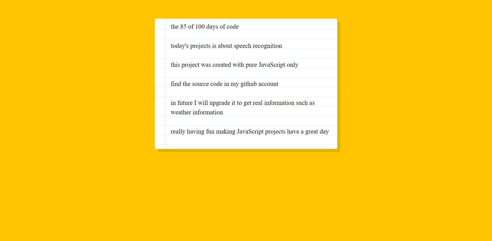

# speech-recognition #javascript
This is an amazing mini project about speech recognition with pure javascript. 
 
In order to get the results or output you have to include recognition.interimResults = true;
 
When you have finished you can continue by adding another addEventListener('end') to recognition to call it again and the speech fuction can run.

